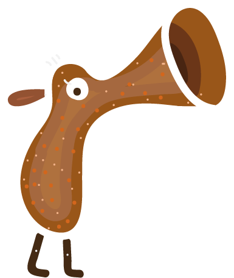
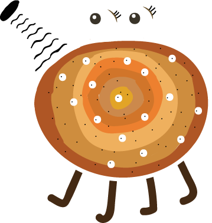

# "Pew"

[деплой](https://tbilisi-pew-16.ya-praktikum.tech/)

Коммандный учебный проект

### Команда:

* [glukomania](https://github.com/glukomania)
* [zenzuk91](https://github.com/zenzuk91)
* [AlexeiA](https://github.com/AlexeiA)
* [MelnikovAleksei](https://github.com/MelnikovAleksei)

Игра "Pew" - это мирная игра про сбор урожая путем плевков в спелые фрукты, которые растут на дереве. Чем спелее фрукт, тем больше очков набирает игрок при попадании. Игроку нужно успеть собрать урожай, т.к. фрукт может перезреть и опасть - это приведет к потере очков. 

Для игры были нарисованы персонажи, дерево с фруктами и многое другое:

В течении 5 спринтов в командной работе были реализованы задачи из [чеклиста для самопроверки перед защитой диплома](https://github.com/tbilisi-student-team/game/issues/98)
